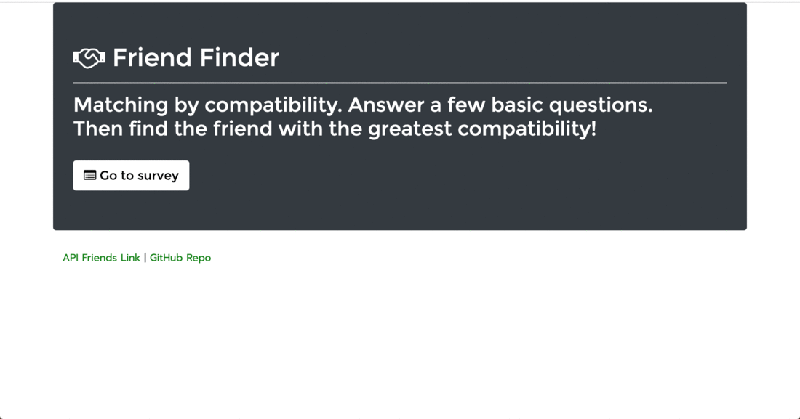

# Friend Finder - Node and Express Servers

A compatibility-based "FriendFinder" application -- basically a dating app. This full-stack site will take in results from the users' surveys, then compare their answers with those from other users. The app display the name and picture of the user with the best overall match. 

Try to find your best match here: https://friendfinder-ia.herokuapp.com/

## Getting Started

#### These instructions will get you a copy of the project up and running on your local machine.

1. Clone the repository
2. Run nmp install 

## Built With

- Html
- Bootstrap
- Javascript
- Jquery
- Nodejs
- Express

## Screenshots

## Comments

It's my first app working with Express and deployingto Heroku.

## Author

Isabel Arcones: https://github.com/iarcones

Here I will be updating some samples of my projects: https://iarcones.github.io/Porfolio/

